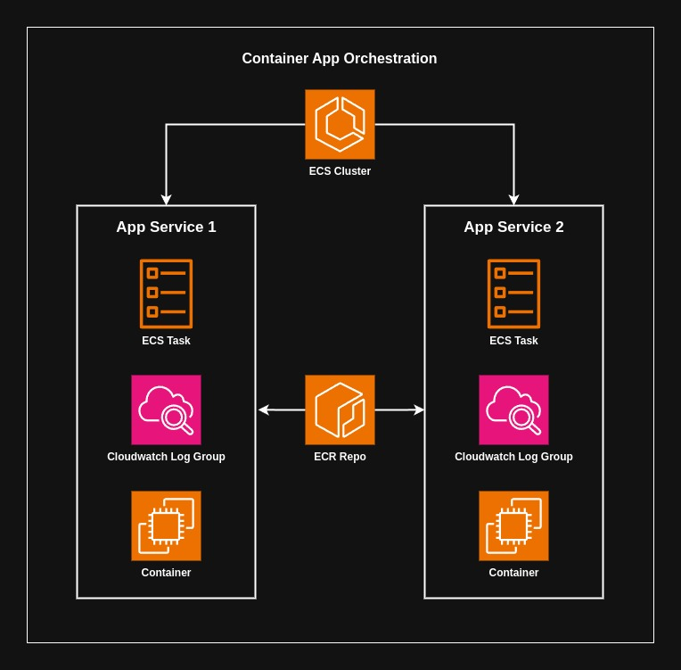
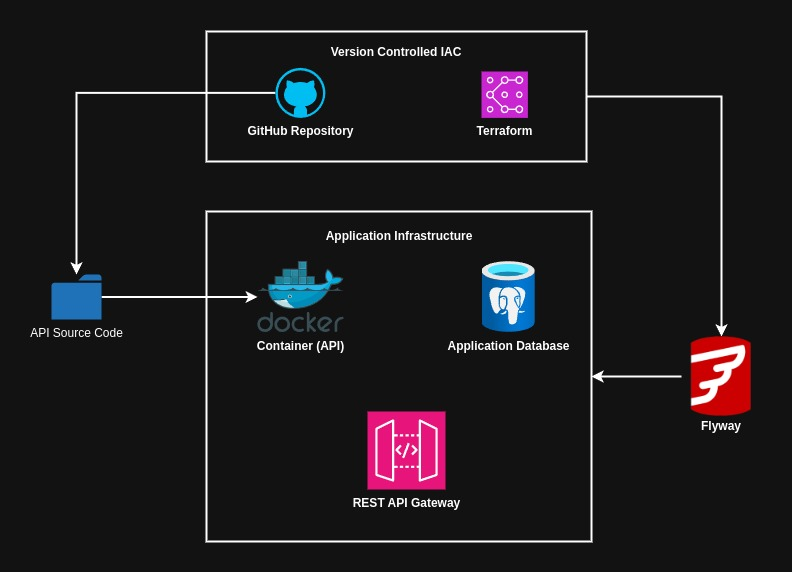
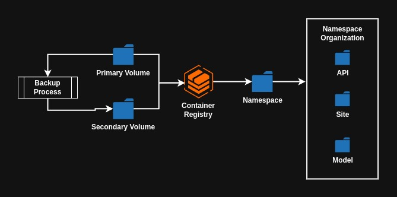
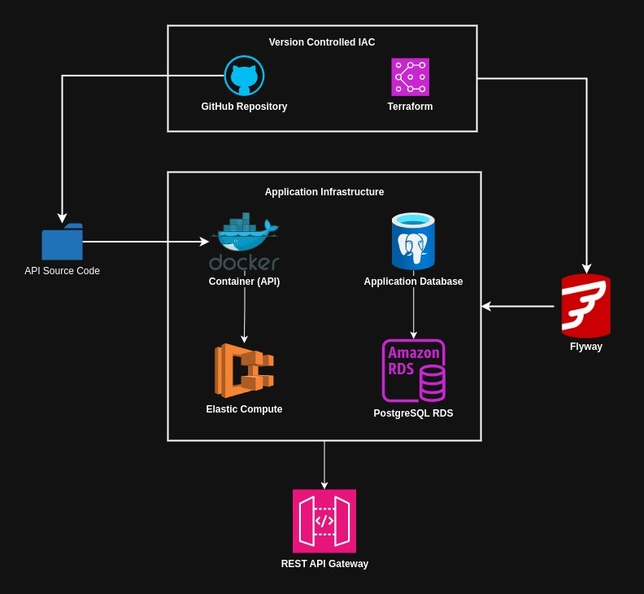

* General module for deploying infrastructure for new "full stack" applications. 
* Deployment for infrastructure is separated between home development server and AWS cloud infrastructure. Github actions will deploy to both environments. 
* Base infrastructure requires a postgres deployment, a public registry to push docker containers to, and network setup on the AWS side.

# On Premises

| Component                     | Description                                                                                                                                                                                              |
| ----------------------------- | -------------------------------------------------------------------------------------------------------------------------------------------------------------------------------------------------------- |
| **Docker Registry**           | Local docker registry hosted on server, all application docker images are pushed to this registry and pulled down during app deployment                                                                  |
| **Postgres Deployment**       | A postgres database cluster needs to exist in order for applications to create databases on it. Deployment is mimimal with no networking setup and regular username and password authentication for now. |
| **API Source Code Container** | All application source code is docker containerized and depends on the local registry existing so that the application source code can be pushed to it.                                                  |

## Container Service Orchestration

* **ECS Cluster**: ECS cluster hosts all container app services, ECS task execution role is attached to cluster to allow tasks to be executed for each container
* **App Service**: App service is deployed within the ECS cluster, pulls container from ECR, then creates a ECS service with a task definition, task definition hosts on port 80/443 for web traffic. Logging is enabled which will log to a corresponding cloudwatch group for monitoring.

## Application Service Architecture

* Infrastructure for managing deployments on the on premises server (ubuntu home server) will be version controlled in GitHub with terraform templates/modules
* Terraform modules will manage docker containers and the application database (postgreSQL). Pushing API source code to the docker container might also be managed by terraform
* The application database migrations will be done using Flyway to keep track of all schema changes/database management.

# On Premise Container Registry

* Hosting a container registry on home server for development and staging of applications before going to production AWS account
* Container registry will have 2 volumes, primary and second volumes for backup recovery and application migrations. 
* Registry will have a namespace organization mechanism, `api` for rest API's, `site` for front end application source code, `model` for machine learning models
#  Cloud Application Service

* Infrastructure for managing deployments to AWS account will be version controlled in GitHub with terraform templates/modules, authorized to deploy to AWS using open ID connect role. 
* Terraform will manage an AWS stack that contains docker containers on ECS and postgreSQL databases using RDS. Each application will contain this stack of resources. 
* The application database migrations will be done using Flyway to keep track of all schema changes/database management.
# Features
| Feature Alias               | Description                                                                                                                                             |
| --------------------------- | ------------------------------------------------------------------------------------------------------------------------------------------------------- |
| Application database module | Module for creating postgres database infrastructure and local docker container for development.                                                        |
| REST service module         | Module for deploying REST API's. Includes container deployment for API source code with AWS and home server.                                            |
| Client side module          | Module for hosting infrastructure needed for front end web applications. Includes deployment to S3 for cloud storage and home server docker container.  |
