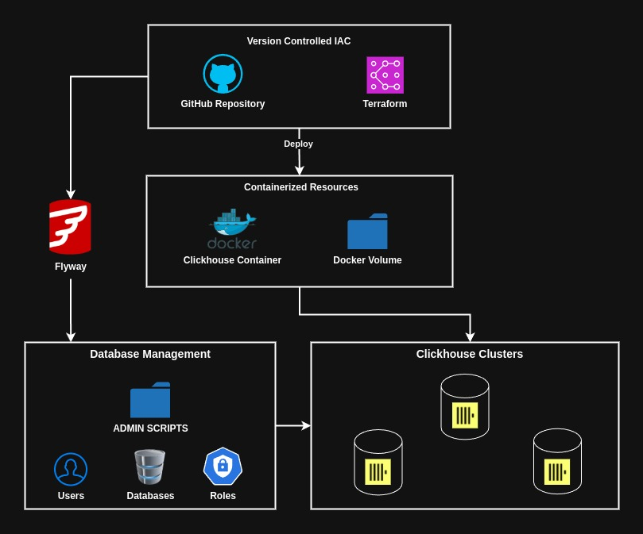
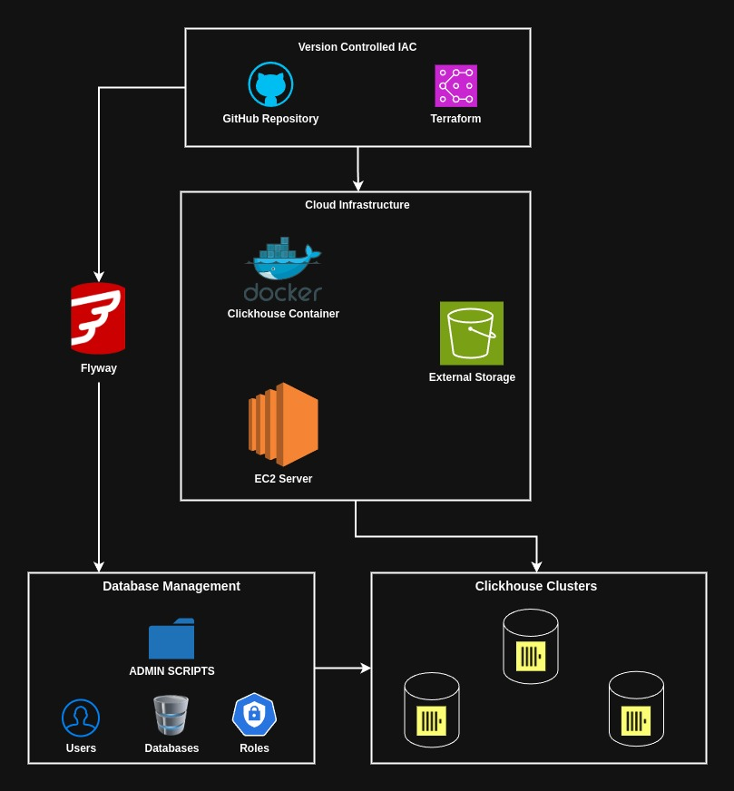

# Data Warehouse Module

* Reusable module for deploying infrastructure needed for data warehousing. Includes boundaries for storage and compute are separated between AWS and local server.
* Databases will come with predefined functionality for storing users and viewing information related to users. 
* On premises deployment is connected to local ubuntu home server. Home server is used as development environment for pipelines. 
* Cloud deployment uses EC2 for managing compute, storage is hosted on AWS S3 blob storage. 

# On Premises Data Warehouse Deployment

## Components
| Feature Alias              | Description                                                                                                                                                                                                    |
| -------------------------- | -------------------------------------------------------------------------------------------------------------------------------------------------------------------------------------------------------------- |
| **Version Controlled IAC** | Changes to infrastructure are managed in CI/CD, for the on premises version,  a github actions runner it setup on the home server to deploy remotely.                                                          |
| **Containerization**       | Making use of the provided clickhouse container for deploying instances on local home server. Clickhouse clusters are allocated based on what resources we provide to the container memory and cpu usage wise. |
| **Database Management**    | A separate repository is used to manage all the clickhouse database administration, and individual database management using flyway (redgate)                                                                  |

# Cloud Data Warehouse Deployment

## Components
| Feature Alias              | Description                                                                                                                                                               |
| -------------------------- | ------------------------------------------------------------------------------------------------------------------------------------------------------------------------- |
| **Version Controlled IAC** | Changes to infrastructure are managed in CI/CD using terraform to manage the docker containers & GitHub repository to host any SQL  or admin database management scripts. |
| **Containerization**       | Resources for hosting click house clusters are containerized with docker. Uses click house server container with a docker volume for storage or S3 for cloud storage.     |
| **Database Management**    | Click house databases are managed using flyway with admin scripts for managing users, roles and databases.                                                                |
