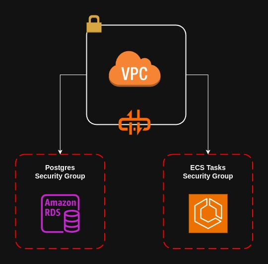

* For deploying on AWS, a VPC (virtual private cloud) configuration is required for us to host networked services that will be accessed over the internet publicly. 
* For our modules, specifically we need networking access for postgres (RDS) and for web traffic to ECS containers hosting web applications or API's
* Down below is the current architecture for what the networking module does within these terraform modules. This is part of the base configuration that needs to be deployed before creating any apps or services.
## Design

* **VPC**: vpc contains configuration for CIDR ranges along with public subnets, availability zones are in `us-east-2`, 3 configured for current setup. DNS host names and support are enabled by default.
* **Postgres Security Group**: Security group configured for allowing connections to postgres with designated port. 
* **ECS Task Security Group**: Security group for allowing web traffic through ECS for HTTP and HTTPS traffic. 

