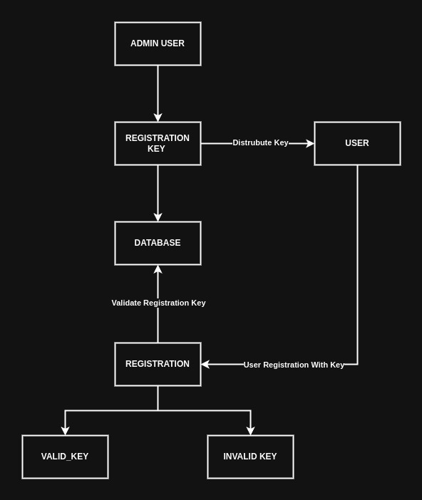

# User Authentication Service

* Service for authenticating users on specific handlers/routes for API's
* Includes 2 factor authentication with E-mail and SMS (Phone numbers), we're not going to do this for on-prem, will do it when AWS stack is deployed and can use SES or SMS services

## User Model
| Field          | Type      | Description                                                                  |
| -------------- | --------- | ---------------------------------------------------------------------------- |
| `ID`           | `INTEGER` | Unique identifier associated with user model                                 |
| `USERNAME`     | `VARCHAR` | Username of the user account                                                 |
| `EMAIL`        | `VARCHAR` | E-mail address associated with user                                          |
| `PHONE_NUMBER` | `VARCHAR` | Phone number associated with account                                         |
| `2FA`          | `BOOLEAN` | Boolean to indicate if one of the 2 factor authentication methods is set up. |
| `PASSWORD`     | `VARCHAR` | Hashed password associated with account                                      |
| `CREATED_AT`   | `DATE`    | Date the user was created/registered                                         |
| `UPDATED_AT`   | `DATE`    | Date the user entry record was updated/modified                              |
| `LAST_LOGIN`   | `DATE`    | Date of last time user logged in                                             |

## Routes

* Main routes the user management service will expose for general authentication & registration and 2 factor validation.

| Route                | Path              | Description                                                                                                                  |
| -------------------- | ----------------- | ---------------------------------------------------------------------------------------------------------------------------- |
| **Register**         | `/users/register` | Create a new user & register with required user model fields                                                                 |
| **Bulk Register**    | `/users/bulk`     | Bulk register an array of user objects                                                                                       |
| **Login**            | `/users/login`    | Provide `username` and `password`, retrieve back API token for authenticating with other routes.                             |
| **2FA**              | `/2fa`            | Validate account login with 2 factor authentication method, provide one time pass-code  from E-mail or text message.         |
| **Password Reset**   | `/password-reset` | Reset password, will be sent E-mail associated with account.                                                                 |
| **Delete User**      | `/users/:id`      | Delete a specific user on the service, 2 factor authentication required for deleting account                                 |
| **Bulk Delete**      | `/users/bulk`     | Bulk delete users with id's provided                                                                                         |
| **Update User**      | `/users/:id`      | Update a specific user and modify the existing fields, changing E-mail or Phone number will prompt for a one time pass code. |
| **Bulk Update User** | `/users/bulk`     | Update an array of users, pass user ids of each object                                                                       |

## Two Factor Authentication 

* User will register on the site with their information, provide the fields required for the user model entry, store the entry in the database.
* Once user is successfully created, the user then has the option to secure the account more with 2 factor auth methods such as E-mail or text message. 
* If the 2 factor authentication method is set to true for the user profile, they will be re-directed to a 2FA screen to validate a code after logging in. 
* 2 factor authentication login sessions store the codes temporarily in the database for up to 15 minutes.  The table in the database indicates if the code is active and  user associated. 
* Date retention policy set up on one time pass code table entries. On a certain time intervals, inactive pass codes get deleted from the database. 

### Table Storing One Time Pass Codes

**Note**: Not completing this in first iteration but will be needed later down the road for E-mail confirmation and sign ups. 

| Field Name   | Type      | Description                                                                        |
| ------------ | --------- | ---------------------------------------------------------------------------------- |
| `ID`         | `INTEGER` | Unique identifier associated with code generation for 2FA                          |
| `USER_ID`    | `INTEGER` | User account one time pass code was generated for                                  |
| `OTP`        | `INTEGER` | 6 digit one time pass code for 2 factor auth                                       |
| `EXPIRATION` | `DATE`    | Date timestamp of when one time passcode is suppose to expire                      |
| `ACTIVE`     | `BOOLEAN` | Boolean to indicate if one time pass code entry is still valid for authentication. |
| `CREATED_AT` | `DATE`    | Date the 2 factor auth entry was created/registered                                |
| `UPDATED_AT` | `DATE`    | Date the 2 factor auth entry was updated                                           |

##  Registration Key Management

* For applications with authentication but not available for full public use, a registration key system will be used to issue unique invites. 
* The user registration route will need to reference registration keys stored in the database to validate if a requester has permission to create an account.
* When a user successfully registers an account with the system, the registration key will be marked as inactive and then can no longer be used to register any more accounts.

### Registration Key Table
| Field Name         | Type      | Description                                               |
| ------------------ | --------- | --------------------------------------------------------- |
| `ID`               | `INTEGER` | Unique identifier associated with code generation for 2FA |
| `REGISTRATION_KEY` | `INTEGER` | User account one time pass code was generated for         |
| `ACTIVE`           | `INTEGER` | 6 digit one time pass code for 2 factor auth              |
| `CREATED_AT`       | `DATE`    | Date the registration key was created                     |
| `UPDATED_AT`       | `DATE`    | Date any of the registration key fields were updated.     |
